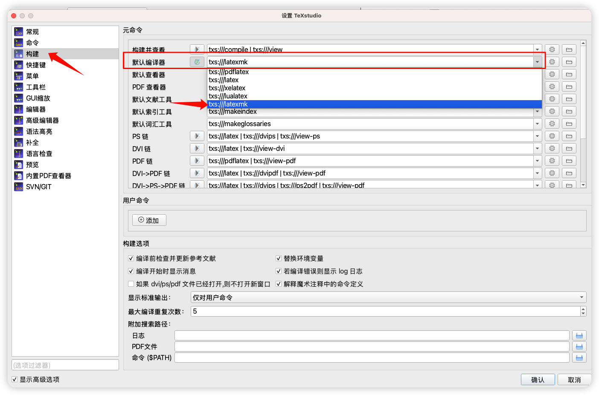
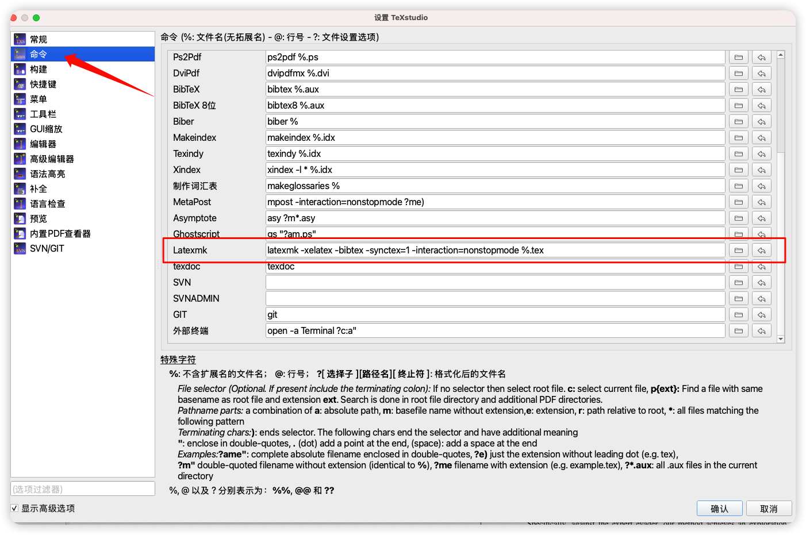

<div align="center">

# Xidian LaTeX Template Guide for macOS

[](https://www.tug.org/texlive/) [](./LICENSE) [](https://www.apple.com/macos/)

[🇨🇳 中文](./README.md) | [🇺🇸 English](./README_EN.md)

</div>

---

## 🙏 Acknowledgements

This project is based on **[XDUTS](https://github.com/note286/xduts)** (Xidian University TeX Suite). Special thanks to **[wjm-jimmy](https://github.com/wjm-jimmy)** for contributing the template.

---

## 📖 Overview

This template is designed specifically for **macOS + TeX Live 2025** environment, helping Xidian students write their theses efficiently. It also supports **Windows** environment (no extra fonts installation required).

### ✨ Core Workflow

- **macOS**: `Extract template (fonts included) → Configure MacTeX 2025 → Update Packages → Compile Thesis`
- **Windows**: `Extract template (fonts included) → Install TeX Live → Update Packages → Compile Thesis`

### ⚠️ Important Notice

Skipping any step may result in: misplaced images, PDF box errors, missing packages, etc. Please follow the steps strictly.

---

## 📥 Download Template

It is recommended to download the packaged Release version. Choose according to your OS:

👉 **[Go to Releases Page](https://github.com/Ronchy2000/Xidian-LaTeX-Template-for-macOS/releases)**

| Version | Filename | Description |
| :--- | :--- | :--- |
| **macOS** | `Xidian-LaTeX-Template-macOS.zip` | ✅ Includes fonts plus MacTeX helper scripts |
| **Windows** | `Xidian-LaTeX-Template-Windows.zip` | ✅ Includes fonts (removes macOS-only scripts) |

---

## 💻 Windows Users

For Windows users, please refer to the dedicated guide:

👉 **[Windows User Guide](./WINDOWS_README.md)**

> The Windows package already bundles the `Font/` assets, so you can unzip and compile directly with no extra font installation or MacTeX setup.

---

## 🚀 Quick Start (macOS)

### Step 1: Fonts (Already Bundled)

The template uses `font-type = file` to load Windows-style Song/Hei/Kai fonts directly from the `Font/` directory, so **no manual font installation is required on macOS**.

If you need these fonts at the system level (e.g., for Pages/Word), follow [Font/Readme.md](./Font/Readme.md) for optional installation instructions.

> 💡 The fonts are provided for thesis typesetting tests only—please respect the copyright notice in [Font/Readme.md](./Font/Readme.md).

---

### Step 2: Configure MacTeX 2025 Environment

#### 2.1 Check Current Version

```bash
/Library/TeX/texbin/xelatex --version | head -1
```

**Interpret results:**
- ✅ Output contains `TeX Live 2025`: Correctly configured, skip to [Step 2.3](#23-update-packages-required)
- ⚠️ Output shows other year or command not found: Need installation/switching, continue to Step 2.2

#### 2.2 Install or Switch to 2025

For detailed installation and switching tutorials, please see:

👉 **[MacTex_Installation_Settings/Readme.md](./MacTex_Installation_Settings/Readme.md)**

This document provides:
- 📥 MacTeX 2025 download and installation guide
- 🔄 Multi-version switching script usage
- 🔧 Complete troubleshooting solutions

**Quick operation**:
```bash
# If 2025 exists but not active, quick switch:
cd MacTex_Installation_Settings
./switch-texlive.sh 2025
```

#### 2.3 Update Packages (Required)

> ⚠️ **Critical Step**: The author once skipped this step, resulting in misplaced images in compiled PDFs!

Whether fresh installation or version switch, you must execute:

```bash
sudo tlmgr update --self --all
```

**Purpose**:
- Update `tlmgr` tool itself
- Sync all packages to latest versions
- Fix known bugs (e.g., `xdvipdfmx` image positioning issues)

> 💡 Recommended to re-execute before each template update.

**Environment setup complete!** Now you can start compiling your thesis.

---

## ⚙️ Thesis Configuration

The detailed manual for this template is `xduts.pdf` located in the project root directory.

Thesis metadata (such as title, author, degree type, etc.) is configured in the `info` field within the `main.tex` file. Please modify the following content according to your actual situation:

```tex
info = {
    graduate-type = {博士},              % Graduate type: PhD/Master
    degree-type = {学术},                % Degree type: Academic/Professional
    degree = {工学博士},                 % Degree name
    title = {自适应学习平台排版流程示例},   % Chinese Title
    title* = {Sample Workflow...},      % English Title
    department = {信息工程学院},          % Department
    major = {智能系统与工程},             % Major
    major* = {Intelligent Systems...},  % Major (English)
    submit-date = {2024-9},             % Submission Date
    author = {西电示例同学},              % Author Name (Chinese)
    author* = {Sample Student},         % Author Name (English)
    supervisor = {示例导师},              % Supervisor Name (Chinese)
    supervisor* = {Sample Advisor},     % Supervisor Name (English)
    student-id = {2024000000},          % Student ID
    % ... Refer to main.tex for other configurations
}
```

---

## 📝 Compiling Your Thesis

### Method 1: Command Line (Recommended)

Execute in project root directory:

```bash
# Compile thesis (XeLaTeX + BibTeX)
latexmk -xelatex -bibtex -synctex=1 -interaction=nonstopmode main.tex

# Clean temporary files (keep .bbl)
latexmk -c

# Full clean (including .bbl)
latexmk -C
```

**After successful compilation**, `main.pdf` will be generated in the root directory.

---

### Method 2: Using TeXstudio

If you prefer a GUI editor, you can configure TeXstudio:

#### Configuration Steps

Open `Options → Configure TeXstudio → Build` and set:

| Option | Value |
|--------|-------|
| Default Compiler | `txs:///latexmk` |
| Default Bibliography Tool | `BibTeX` |
| PDF Viewer | `Internal PDF Viewer (Embedded)` |
| Build & View | `txs:///latexmk | txs:///view` |



In `Commands → Latexmk`, enter:
```
latexmk -xelatex -bibtex -synctex=1 -interaction=nonstopmode %.tex
```



#### Add Clean Commands (Optional)

In `Tools → User Commands`, add:
```
latexmk -c %.tex        # Clean
latexmk -C %.tex        # Clean Full
```

#### Lock Main Document

Ensure `main.tex` is locked as the Root document in TeXstudio toolbar.

**After configuration**, click "Compile" or "Build & View" to run latexmk and preview your thesis.

---

## 🔧 Advanced Configuration

### Centralized Output Management

To keep the project root clean, centralize build output to `build/` directory:

```bash
latexmk -xelatex -bibtex -synctex=1 \
  -outdir=build \
  -auxdir=build/aux -emulate-aux-dir \
  -interaction=nonstopmode main.tex
```

**Clean commands**:
```bash
latexmk -c -outdir=build -auxdir=build/aux -emulate-aux-dir
latexmk -C -outdir=build -auxdir=build/aux -emulate-aux-dir
```

> 📌 `-emulate-aux-dir` feature requires TeX Live 2025.

---

### Using latexmkrc to Simplify Commands

Create a `latexmkrc` configuration file in project root:

```perl
$pdf_mode = 1;
$pdflatex = 'xelatex -interaction=nonstopmode -file-line-error -synctex=1 %O %S';
$bibtex   = 'bibtex %O %S';
$out_dir         = 'build';
$aux_dir         = 'build/aux';
$emulate_aux_dir = 1;
$clean_ext       = 'synctex.gz xdv run.xml';
$clean_full_ext  = 'bbl';
```

**After configuration**, simply run:
```bash
latexmk        # Compile
latexmk -c     # Clean
latexmk -C     # Full clean
```

**View PDF** (optional):
```bash
ln -sf build/main.pdf ./main.pdf
```

---

## 📂 Project Structure & Resource Management

### Directory Structure

```
.
├── main.tex              # Main document
├── chapters/             # Chapter contents
├── figures/              # Image resources
│   ├── ch2/             # Chapter 2 images
│   ├── ch3/             # Chapter 3 images
│   └── ...
├── Font/                 # Windows font files
├── MacTex_Installation_Settings/  # MacTeX management tools
└── build/                # Build output (optional)
```

### Image Management

- Store all images in `figures/` directory
- Use separate subdirectories for each chapter (e.g., `ch2/`, `ch3/`)
- Reference in text: `\includegraphics{figures/ch2/example.pdf}`

### Git Ignore Suggestions

Add to `.gitignore`:

```gitignore
build/
*.synctex.gz
*.xdv
*.aux
*.log
*.out
```

---

## ❓ Common Issues

### Issue 1: PDF "tagged" Warning

**Error message**: `PDF file is tagged...` or `Object @page.n already defined.`

**Cause**: Metadata issues in old PDF images.

**Solution**:
- Keep TeX Live updated (execute `sudo tlmgr update --self --all`)
- Or add parameters in `\includegraphics`: `pagebox=cropbox` or `trim=...`

---

### Issue 2: Chinese Punctuation Error

**Error message**: `Missing character: There is no ， in font cmr12!`

**Cause**: Chinese punctuation cannot be directly used in math mode.

**Solution**: Wrap Chinese punctuation with `\text{，}`.

```latex
% Wrong
$x = 1，y = 2$

% Correct
$x = 1\text{，}y = 2$
```

---

### Issue 3: Misplaced Images After Compilation

**Cause**: Package update not executed.

**Solution**: Execute `sudo tlmgr update --self --all` immediately.

---

## 📚 About XDUTS

**XDUTS** (Xidian University TeX Suite) is the officially recognized LaTeX template for undergraduate/graduate theses at Xidian University, supporting multiple platforms:

- ✅ Windows / macOS / Linux
- ✅ Overleaf online editing
- ✅ XeLaTeX compilation

### Template Files

- `xdufont.sty` - Font configuration package
- `xdupgthesis.cls` - Graduate thesis document class
- `xduugthesis.cls` - Undergraduate thesis document class
- `xduugtp.cls` - Undergraduate course paper document class

### More Resources

- 📖 Complete documentation: `xduts.pdf`
- 🔗 Upstream project: [XDUTS on GitHub](https://github.com/note286/xduts)
- 📦 CTAN release: [CTAN Package](https://www.ctan.org/pkg/xduts)

---

## ⚡ One-Line Workflow

```bash
# 1️⃣ Update packages
sudo tlmgr update --self --all

# 2️⃣ Compile thesis
latexmk -xelatex -bibtex -synctex=1 main.tex

# 3️⃣ Clean temporary files
latexmk -c
```

**Good luck with your thesis writing!** 🎓
